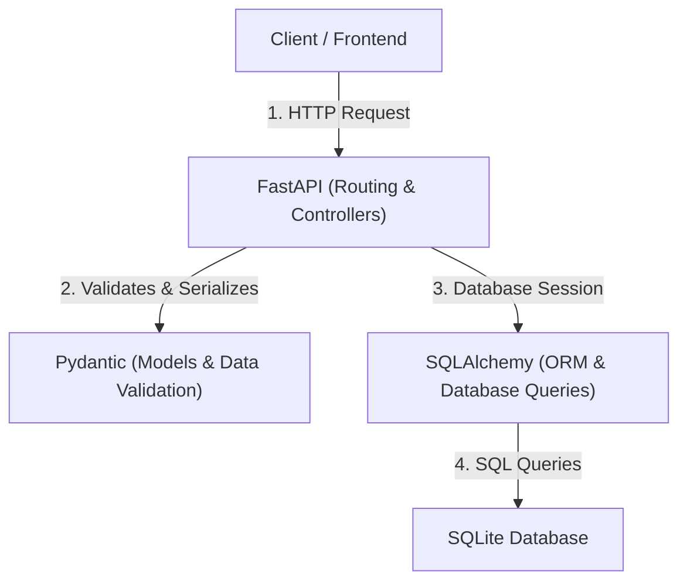

# FastAPI + Pydantic + SQLAlchemy Integration Guide

Welcome to the **FastAPI, Pydantic, and SQLAlchemy** lecture guide! This document is structured to help you teach students how these three technologies fit together, starting from basic file storage validation with Pydantic up to database integration using SQLAlchemy.

---

## 1. Core Architecture: The Three Pillars

To build robust, production-ready APIs in Python, we combine three distinct tools, each handling a specific layer of the application:



### 1. FastAPI (The Web Framework)
Handles routing, HTTP methods (GET, POST, etc.), request parsing, and automatic Swagger documentation.

### 2. Pydantic (The Data Validator)
Validates incoming request payloads and serializes outgoing API responses. It uses standard Python type hints to ensure data integrity.

### 3. SQLAlchemy (The ORM)
Object-Relational Mapping (ORM) tool. It translates database tables into Python classes, allowing you to run database queries using Python code instead of raw SQL.

---

## 2. Phase 1: Pydantic Validation with File Storage

A great way to introduce Pydantic is to use a simple JSON file database (`patients.json`). This isolates the concepts of routing and validation before introducing database connections.

### 1. Define Pydantic Models (`models.py`)
Create a file named `models.py` to define the shape of your data and its validation rules:

```python
from pydantic import BaseModel, Field, EmailStr

class Patient(BaseModel):
    # Field(...) defines properties of each field (validation rules, examples, description)
    id: int = Field(..., description="The unique identifier for the patient", examples=[1])
    name: str = Field(..., description="The full name of the patient", examples=["John Doe"])
    age: int = Field(..., ge=0, le=120, description="The age of the patient (0-120)", examples=[45])
    gender: str = Field(..., description="The gender of the patient", examples=["Male"])
    blood_group: str = Field(..., description="The blood group of the patient", examples=["O+"])
    phone: str = Field(..., description="The contact phone number", examples=["+1-555-123-4567"])
    email: EmailStr = Field(..., description="The email address of the patient", examples=["john.doe@example.com"])
    diagnosis: str = Field(..., description="Medical diagnosis description", examples=["Hypertension"])
    admitted: bool = Field(default=False, description="Is the patient currently admitted?", examples=[True])
```

#### Pydantic Keywords & Features Explained:
When explaining `models.py` in your lecture, cover these core concepts:
* **`BaseModel`**: The foundation of any Pydantic model. By inheriting from it, your class gains automatic type checking, validation, and serialization (parsing python dicts to JSON and vice-versa).
* **`Field()`**: A function used to customize validation and metadata for specific fields.
* **`...` (Ellipsis)**: Specifies that the field is **required**. If the client sends a request without a required field, Pydantic blocks the request and returns a `422 Unprocessable Entity` error.
* **`default=False`**: Specifies a default value when a field is optional. If the client omits `admitted`, it defaults to `False`.
* **`ge=0` and `le=120`**: Numeric validation bounds. `ge` stands for **Greater than or equal to**, and `le` stands for **Less than or equal to**. Pydantic ensures the input falls strictly within `[0, 120]`.
* **`EmailStr`**: A special data type that automatically validates that the string conforms to a valid email format (e.g., `user@domain.com`). It requires the `email-validator` library to be installed.
* **`description`**: Developer/user documentation. FastAPI reads this to generate descriptions for your fields inside the Swagger UI.
* **`examples`**: Provides mock data for the field. FastAPI uses this to generate the interactive model payload template inside Swagger UI (`/docs`).

### 2. Implement the API Routes (`main.py`)
Now import the `Patient` model into `main.py` and use it in your routes:

```python
from fastapi import FastAPI, Path, HTTPException, status
from fastapi.params import Query
from typing import List
import json

# Import the Pydantic model
from models import Patient

app = FastAPI(
    title="Patient Management System",
    description="A basic FastAPI lecture setup demonstrating Pydantic validation.",
    version="1.0.0"
)

# Helper function to read from JSON file
def load_data():
    with open('patients.json', 'r') as f:
        data = json.load(f)
    return data

# Helper function to write to JSON file
def save_data(data):
    with open('patients.json', 'w') as f:
        json.dump(data, f, indent=2)

@app.get("/")
def read_root():
    return {"message": "Welcome to the Patient Management API. Visit /docs for interactive Swagger UI."}

# 1. GET all patients - return a validated list of Patients
@app.get('/patients', response_model=List[Patient])
def show_patients():
    data = load_data()
    return data

# 2. GET search patients - query validation
# NOTE: This static route is defined BEFORE the dynamic /{patient_id} route
@app.get('/patients/search', response_model=List[Patient])
def search_patients(
    name: str = Query(None, description="The name of the patient to search for", examples=["John"])
):
    data = load_data()
    name = name.strip() if name else ""
    results = [patient for patient in data if name.lower() in patient['name'].lower()]
    return results

# 3. GET single patient by ID - path validation
@app.get('/patients/{patient_id}', response_model=Patient)
def show_patient(
    patient_id: int = Path(..., description="The ID of the patient to retrieve", examples=[1])
):
    data = load_data()
    for patient in data:
        if patient['id'] == patient_id:
            return patient
    
    # Proper HTTP Exception handling
    raise HTTPException(
        status_code=status.HTTP_404_NOT_FOUND, 
        detail=f"Patient with ID {patient_id} not found."
    )

# 4. POST add patient - validates request body against Pydantic schema
@app.post('/patients', response_model=Patient, status_code=status.HTTP_201_CREATED)
def add_patient(patient: Patient):
    data = load_data()
    
    # Check for ID conflicts
    for existing in data:
        if existing['id'] == patient.id:
            raise HTTPException(
                status_code=status.HTTP_400_BAD_REQUEST, 
                detail=f"Patient with ID {patient.id} already exists."
            )
            
    # patient.model_dump() converts Pydantic object back into a standard Python dictionary
    data.append(patient.model_dump())
    save_data(data)
    
    return patient
```

---

## 3. Phase 2: Transition to a SQL Database (SQLAlchemy)

Once students understand how Pydantic validates incoming requests and formats outgoing responses, transition to using a SQL database with SQLAlchemy ORM.

### 1. The Key Difference: Models vs. Schemas
* **SQLAlchemy Model (`Patient`):** Tells the **database** what columns exist, their types, and constraints (e.g., primary keys, uniqueness).
* **Pydantic Schema (`PatientBase` / `PatientResponse`):** Tells the **client/API** what input structure is allowed and what output structure is returned.

### 2. SQLAlchemy + Pydantic Integration Code
When migrating from JSON to a database, the code structure looks like this:

```python
from sqlalchemy import create_engine, Column, Integer, String, Boolean
from sqlalchemy.ext.declarative import declarative_base
from sqlalchemy.orm import sessionmaker, Session
from fastapi import Depends

# 1. DB Setup
SQLALCHEMY_DATABASE_URL = "sqlite:///./patients.db"
engine = create_engine(SQLALCHEMY_DATABASE_URL, connect_args={"check_same_thread": False})
SessionLocal = sessionmaker(autocommit=False, autoflush=False, bind=engine)
Base = declarative_base()

# 2. Database Model
class DBPatient(Base):
    __tablename__ = "patients"
    id = Column(Integer, primary_key=True, index=True)
    name = Column(String, nullable=False)
    age = Column(Integer, nullable=False)
    email = Column(String, unique=True, index=True, nullable=False)
    # ...other columns...

# 3. Create Tables
Base.metadata.create_all(bind=engine)

# 4. Database Session Lifecycle Dependency
def get_db():
    db = SessionLocal()
    try:
        yield db
    finally:
        db.close() # Connection is closed after request finishes
```

### 3. Reading SQLAlchemy Objects as Pydantic Models
By default, Pydantic expects dictionaries (`data["email"]`). However, SQLAlchemy returns database objects (`patient.email`).
To bridge this gap, add this configuration class to your Pydantic schemas:
```python
class PatientResponse(PatientBase):
    id: int

    class Config:
        from_attributes = True # Enables Pydantic to read ORM object attributes
```

---

## 4. Key Teaching Points for Your Lecture

1. **Routing Order Gotcha:** Explain why `/patients/search` must be placed **before** `/patients/{patient_id}` in code (otherwise, `/patients/search` is parsed as a patient ID of value `"search"`, yielding a 422 error).
2. **Dependency Injection (`Depends(get_db)`):** Explain the `yield` keyword. It provides a database session to the handler and guarantees it closes when the request finishes, preventing connection leaks.
3. **Data Serialization:** Emphasize how `patient.model_dump()` converts Pydantic objects to dicts for JSON storage, and how `from_attributes = True` reads SQLAlchemy ORM objects directly.

---

## 5. Testing Examples in Swagger UI (`/docs`)

Start the server:
```bash
uvicorn main:app --reload
```
Open `http://127.0.0.1:8000/docs` and show these live execution examples:

### 1. Show automatic error validation (POST `/patients`)
Send an invalid email format and a negative age:
```json
{
  "id": 10,
  "name": "Alex",
  "age": -5,
  "gender": "Non-binary",
  "blood_group": "B+",
  "phone": "555-5555",
  "email": "not-an-email",
  "diagnosis": "None"
}
```
Show the client response: `422 Unprocessable Entity`. FastAPI automatically returns a clean JSON error array pinpointing exactly what failed validation.

### 2. Create a Valid Patient (POST `/patients`)
Send valid parameters:
```json
{
  "id": 6,
  "name": "Alice Green",
  "age": 29,
  "gender": "Female",
  "blood_group": "O-",
  "phone": "+1-555-901-2345",
  "email": "alice.green@example.com",
  "diagnosis": "Healthy",
  "admitted": false
}
```
Returns a `201 Created` status code and saves the patient into `patients.json`!
